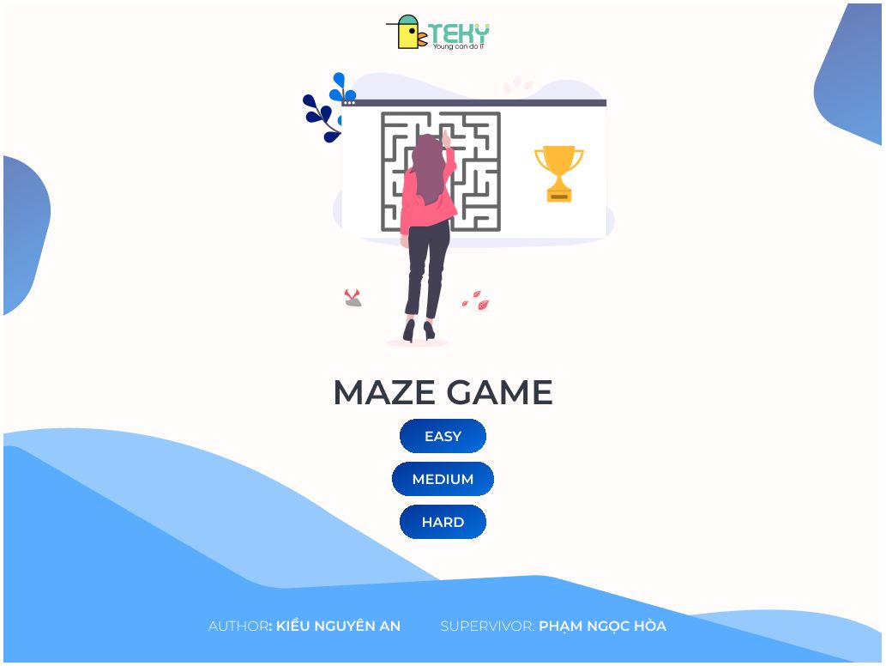
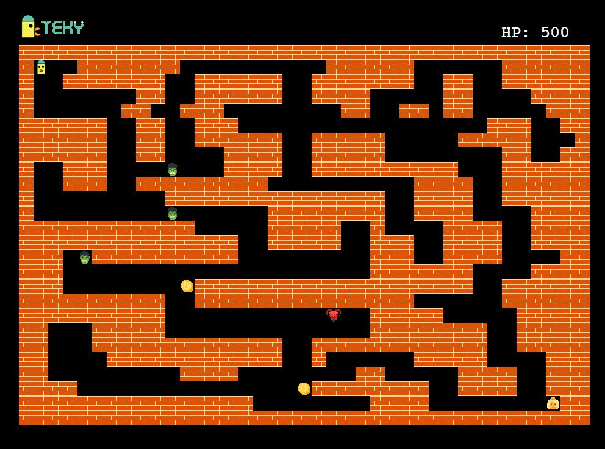
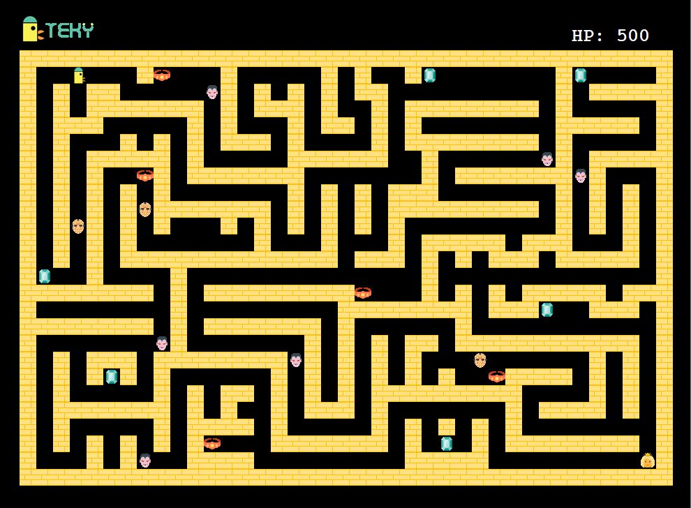

# Maze Game

This is final project of my student course python LV2 in **TEKY Academy**.

## Description

Game have one player whose name is teky. Start gane player have 500hp, if hp of player <= 0, player will die and *Game Over*. If player collision monster, player will lose some hp. Else if player collision treature, player will add some hp. The player will win when player collect all treature and players rescue the princess at the bottom of the map.

## Usage

Run file `main.py`

## Screen shot

## Author

- Lecturers: Phạm Ngọc Hòa <thaycacac@gmail.com>
- Student: Kiều Nguyên An <kieunguyenan5a2@gmail.com>